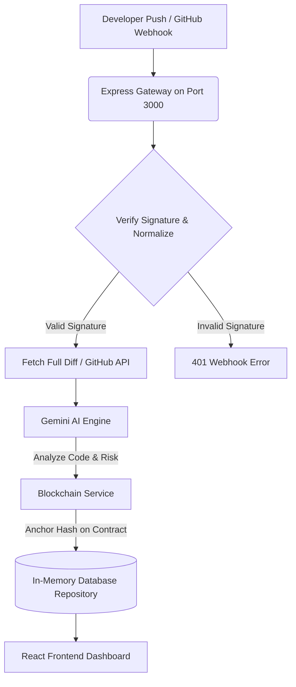

# HackProof AI - Project Summary, User Roles & Features

HackProof AI is a next-generation developer-integrity and automated hackathon auditing platform. It continuously monitors hackathons by validating the source code commits made by participating teams in real-time, archiving check-ins on an immutable blockchain ledger, and using the Gemini AI Engine to analyze developer progress, flag anomalies, and create custom demonstration checks.

The application features a sleek, high-fidelity dark-themed frontend dashboard constructed to provide transparency and peace-of-mind to organizers, judges, and hackers alike.

---

## 1. Frontend Interface & Interactive Features

The user interface of HackProof AI features a modern, real-time control console accessible to different user types. Below is an overview of the key components and features visible on the frontend:

### 🌐 The Landing Page (Public View)
* **Comparative Paradigm Showcase**: Displays a clear comparison between traditional manual hackathon judging (prone to plagiarism, template pasting, and presentation exaggeration) and HackProof AI-enabled evaluation.
* **Interactive Platform Blueprint**: A visual node diagram illustrating how payloads flow from git pushes to AI summaries, smart contract anchoring, and finalized scorecard reviews. Users can click different steps in this diagram to inspect the process flow.
* **Live Telemetry & Activity Feed**: A floating global status ticker showing simulated system times, ledger security status, active anomaly rates, and average speeds.

### 👤 Role-Based Portals & Dashboards

The application is structured around four primary user personas, each with a dedicated cockpit interface:

#### 1. Hacker Team Hub (`hackathon-team`)
Designed for participating hackathon developers to submit code and manage their project profile.
* **Simulate Git Push (Interactive Command Bar)**: A live form allowing teams to simulate real-time pushes. Developers can customize the commit message, commit category (Frontend, Backend, Blockchain, Database, AI, Docs), lines of code added or deleted, and files changed.
* **Real-time Project Timeline**: A chronological feed of all commits made by the team, displaying AI summaries of their work, categorized language badges, lines changed, and cryptographic blockchain signatures.
* **Anomaly alerts & Flagging**: When a commit triggers an anomaly warning (such as importing a pre-made template with >4,000 lines of code or bypassing audit history via a `force push`), the system displays a yellow warning box.
* **Formal Justification Dialogs**: Hackers can directly type and submit explanations/justifications for flagged commits, which are instantly sent to the Judges for review.

#### 2. Judging Operations Cockpit (`judge`)
Designed for hackathon evaluators to inspect projects, ask questions, and verify claims.
* **Team Selector Matrix**: Quick buttons to toggle between active teams, showing avatar icons, progress meters, and alert badges.
* **Live Claims Match Verification**: Judges can select a feature claimed by a team, and click a microphone button to **simulate a live audio transcript** of their presentation. The frontend displays the speech-to-text transcription progress and automatically verifies if the team's spoken claims match their actual repository file footprints.
* **AI Technical Interviewer (Suggested Q&As)**: Generates tailored, non-generic technical questions based on the specific code changes. It provides judges with context, exact lines of code targeted, and suggested answer keys to verify if the team actually authored the project.
* **Cryptographic Justification Reviews**: A module where judges review justifications submitted by hackers for flagged commits, with buttons to either **Approve** (reducing team risk score) or **Reject** (increasing risk score).
* **1-Click Evaluation Report Export**: A preview panel that compiles a comprehensive markdown scorecard including team rosters, blockchain signature percentages, verified claim counts, and risk analysis.

#### 3. Organizer Control Desk (`organizer`)
Designed for hackathon hosts to register teams and monitor event telemetry.
* **Global Activity KPI Dashboard**: Tracks key performance metrics across the hackathon (total active teams, global commit volume, average commit rate, and unresolved alert warnings).
* **Metric Summary & Tech Popularity Charts**: Visual bar meters detailing which programming stacks are most popular among participants.
* **Registration Suite**: A form to onboard new teams by adding their team name, lead developer, repository URL, tech stack tags, and custom avatar emoji.
* **System-Wide Auditor Log**: A live console showing everything happening in the hackathon, including new registrations, blockchain verifications, and alert resolutions.

#### 4. Guests & Security Guards
* **Auth Gate (Role-Mismatched Guard)**: Secures access to restricted dashboards. If a user logs in with a specific role (e.g., Hacker) and tries to access an unauthorized panel (e.g., Judge Cockpit), a beautiful cryptographic mismatch screen is shown to block access.

---

## 2. Technical Architecture & Data Flow

### System Flow Description
1. **GitHub Webhook / Simulation**: A developer pushes code, triggering a webhook event sent to `/api/webhooks/github` (or simulated directly from the frontend).
2. **Signature Verification**: The Express server validates the signature payload using the webhook secret.
3. **Detail Fetching**: If needed, the full code patch/diff is pulled from the GitHub REST API.
4. **AI Processing**: The Gemini Engine evaluates the changes, categorizes them, summarizes the work, and flags potential risk vectors.
5. **Blockchain Anchoring**: The system computes a SHA-256 hash of the audit summary, anchors the metadata on-chain via the smart contract event emitter, and appends the resulting transaction hash to the database.
6. **Dashboard Live Feed**: Broadcasts state updates to the React client, displaying real-time velocity warnings, project metrics, and generated interview questions.

---

## 3. REST API Specifications

The Express gateway exposes several crucial endpoints under `/api`:

| Method | Endpoint | Description |
| :--- | :--- | :--- |
| **GET** | `/health` | Retrieves server status and external service configurations (Gemini, GitHub, Blockchain). |
| **GET** | `/api/teams` | Lists all registered teams, stack info, overall risk metrics, and commit streams. |
| **POST** | `/api/teams` | Registers a new team and triggers an initial synchronization from their GitHub repository. |
| **POST** | `/api/webhooks/github` | Listens for incoming GitHub push payloads and runs the audit pipeline. |
| **POST** | `/api/commits/:hash/justification` | Allows hackers to submit explanations for flagged suspicious activities. |
| **PATCH** | `/api/commits/:hash/review` | Allows judges to accept or reject submitted hacker justifications. |
| **POST** | `/api/teams/:id/verify-presentation` | Audits real-time presentation transcripts against the actual Git footprint. |
| **GET** | `/api/stats` | Returns global hackathon activity telemetry (active warning counters, team averages). |

---

## 4. Technology Stack Summary

* **Backend Gateway**: Node.js & TypeScript, Express, Zod (Validation), TSX & TSC.
* **AI Engine**: Modern `@google/genai` TypeScript SDK referencing the Gemini 2.5 Flash and 2.5 Pro models.
* **Blockchain Integrations**: DB-backed simulated chain that mimics block/tx semantics with queryable REST endpoints for exploring the dummy ledger.
* **Frontend Clients**: Modular, type-safe API clients in the `hackproof-ai` React application for seamless server-side integration.

